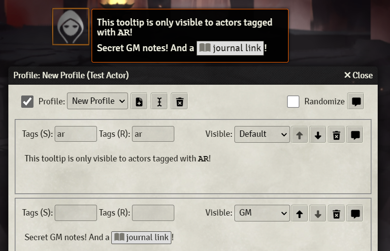

# Token Profile

A [FoundryVTT](https://foundryvtt.com/) module for creating actor 'profiles' that can be displayed as tooltips (on token mouse hover) or in chat.

## Features

Supports multiple profiles and multiple paragraphs per profile, with easy switching and ordering. Each profile can be quickly enabled or disabled, with either the first or a randomized profile being shown depending on settings.

Each paragraph has separate visibility settings and can be shown depending on token ownership level, vision of the viewing player/token, [Tagger](https://foundryvtt.com/packages/tagger) tags, [Perceptive](https://foundryvtt.com/packages/perceptive) vision layers and if that isn't enough, there are some [hooks](https://foundryvtt.wiki/en/development/api/hooks) for macro or module extensibility.

Optionally, [GM Notes](https://foundryvtt.com/packages/gm-notes/) can be shown in tooltips for GMs as well.

## Use cases

- Allow players to set up profiles with physical descriptions of their characters and maybe an image as reminder for the others. Especially useful in text only games.
- Jot down some GM only notes on actors that you can easily reference with mouseover. Roleplaying or plot reminders? Combat turn-by-turn plan for the boss?
- Playing in a futuristic game where people broadcast profile information? Hello, Chummer. Create profiles with 'AR' tags, for example, and have them at your player's augmented fingertips.
- Have actors setup as merchants, vendors or vending machines? [Item Piles](https://foundryvtt.com/packages/item-piles) is great for that. And now, those can have advert blurb tooltips too! Or a quick info of what they have to offer, current sales, whatever you can be bothered to put into the profiles. If you set the token to a transparent image, you can probably even create some environmental tooltips.

## Installation

Use Foundry's packager manager or use this URL with its install from manifest URL feature:

<https://github.com/mhilbrunner/tokenprofile/releases/latest/download/module.json>

If you want to install a specific release, browse the available versions for links to version-specific `module.json` files:

<https://github.com/mhilbrunner/tokenprofile/releases>

## Caveats

Keep in mind all data is stored in actor [flags](https://foundryvtt.wiki/en/development/api/flags). Maybe don't write the next Lord of the Rings trilogy in a profile and then make tons of copies of that actor. Or do it, who am I to judge.

## Credits

This module takes heavy inspiration from various MMO roleplaying flag addons and Foundry modules like [GM Notes](https://foundryvtt.com/packages/gm-notes/), [Illandril's Token Tooltips](https://foundryvtt.com/packages/illandril-token-tooltips), [Token Note Hover](https://foundryvtt.com/packages/token-note-hover) and [Visual Active Effects](https://foundryvtt.com/packages/visual-active-effects). Those are great modules, check them out!

## License

The code is licensed under the terms of the MIT license, see [LICENSE](LICENSE).
Regarding Foundry, this is a work under the Limited License Agreement for Package Development, as outlined [here](https://foundryvtt.com/article/license/).
